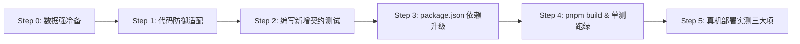

# DeepSeek Harness 0.1.5-rc.1 升级全量修改适配方案

> **项目名称**：`dsh-napcat-bridge` (NapCat/OneBot 11 QQ 桥接插件)  
> **基准版本**：DeepSeek Harness `0.1.2-rc.1`  
> **目标版本**：DeepSeek Harness `0.1.5-rc.1`  
> **审查基线**：`/tmp/dsh-review/v012` (227 个包) vs `/tmp/dsh-review/v015` (224 个包)  
> **归档位置**：`docs/DSH-0.1.5-rc.1升级全量修改适配方案.md`  
> **编制日期**：2026-09-10  

---

## 目录

1. [执行摘要与审查汇总 (Executive Summary)](#1-执行摘要与审查汇总-executive-summary)
2. [必须修改的代码清单与具体实现 (Actionable Code Modifications)](#2-必须修改的代码清单与具体实现-actionable-code-modifications)
   - [2.1 `package.json`：依赖与 Peer 范围全量升级](#21-packagejson依赖与-peer-范围全量升级)
   - [2.2 `src/gateway/session.ts`：V3 路径转义、持久化探针与排他锁容错](#22-srcgatewaysessiontsv3-路径转义持久化探针与排他锁容错)
   - [2.3 `src/memory/review.ts`：临时会话销毁时序重构（内核锁释放先行）](#23-srcmemoryreviewts临时会话销毁时序重构内核锁释放先行)
   - [2.4 `src/commands/index.ts`：模型同步 Monkey Patch 互斥加锁与 Flash 补全](#24-srccommandsindexts模型同步-monkey-patch-互斥加锁与-flash-补全)
3. [建议新增与回归契约测试 (Test Suites Plan)](#3-建议新增与回归契约测试-test-suites-plan)
4. [零破坏/免修改项终审判定 (Zero Impact Verification)](#4-零破坏免修改项终审判定-zero-impact-verification)
5. [执行落地路线与真机三步实测方案 (Rollout & Verification)](#5-执行落地路线与真机三步实测方案-rollout--verification)

---

## 1. 执行摘要与审查汇总 (Executive Summary)

针对 `docs/DSH-升级0.1.5-rc.1全量依赖影响与架构审查报告.md`，我们派出了 3 个专职审查子代理，深入查阅了本地下载解压的 DSH `0.1.5-rc.1` 完整源码（位于 `/tmp/dsh-review/v015/`，共 224 个包），对桥接代码的全部触点进行了逐行推演和符号对照。

### 核心审查发现与风险归纳：
1. **【阻断】`package.json` 版本范围不兼容**：SemVer Pre-release 隔离规则导致 `semver.satisfies('0.1.5-rc.1', '^0.1.2-rc.1') === false`。必须将 17 个 peerDependencies 和 19 个 devDependencies 提升至 `0.1.5-rc.1`。
2. **【高危】排他锁竞争连环崩溃隐患**：DSH 0.1.5 引入了底层 `session.lock`（POSIX `flock(2)`）。若会话被 Web 控制台打开，`agents.resume` 抛出 `SessionAlreadyOwnedError`；桥接当前直接 catch 并回退至 `agents.create({ sessionId })`，底层会立即抛出 `SessionAlreadyExistsError`，导致唤醒链路彻底抛错崩溃。必须加入重试退避与锁拦截逻辑。
3. **【高危】临时会话销毁时序倒置**：`destroyTemporarySession` 先执行物理 `rm` 目录，最后才执行 `agentHandle.dispose()`。在 0.1.5 下未 `dispose` 时写句柄持有着 `session.lock` 内核锁，在 Windows 上报 `EBUSY` 删除失败，在 Linux 上产生孤儿 inode。必须重构执行时序，**内核锁释放先行**。
4. **【高危】持久化探针失效与 V3 路径编码**：`SessionPersistence.locate` 接口已被彻底移除。V3 格式会话落盘为 `session.v3.jsonl`，目录名强制经过 `encodeSegment(sessionId)` 编码。旧探针直接比对未编码目录名会导致带特殊字符的 SessionId 判定失灵，进而引发会话递增编号被误重置。
5. **【中危】`/model` Monkey Patch 并发竞态**：`selectModel` 依然调用全局 `saveSelection`。当前无锁置空在多请求并发或 `-g` 批量修改时，后发协程会将先发协程的 dummy 函数误作为“原函数”记录，导致全局保存函数被**永久替换为 no-op dummy**， Web 端的全局模型修改被永久吞噬。必须引入 Promise 互斥锁链与引用计数。
6. **【安全/零影响项】**：`Context.agent` 移除对桥接零影响（桥接始终通过 handle 获取）；`settings.plugin.item` UI 插槽 100% 兼容；`dsh-http-proxy` 强制内置 `LOOPBACK_NO_PROXY`，本地反向 WebSocket 服务不受全局代理干扰；`systemPrompt.context()` 动态注入保持向下兼容。

---

## 2. 必须修改的代码清单与具体实现 (Actionable Code Modifications)

### 2.1 `package.json`：依赖与 Peer 范围全量升级

- **文件**：`package.json:65-103`
- **原因**：SemVer 规则对带有 `-rc.1` 等 pre-release 标签的版本采取严格三元组匹配，现有的 `^0.1.2-rc.1` 会直接被 npm/pnpm 判定为依赖冲突拒绝安装。
- **修改方案**：保持 `cordis` 和 `schemastery` 的版本不变，将所有 `@deepseek-ai/dsh-*` 的 `peerDependencies` 改为 `^0.1.5-rc.1`，`devDependencies` 改为 `0.1.5-rc.1`。

```diff
--- a/package.json
+++ b/package.json
@@ -66,16 +66,16 @@
     "@deepseek-ai/cordis": "^4.0.2",
-    "@deepseek-ai/dsh-agent": "^0.1.2-rc.1",
-    "@deepseek-ai/dsh-app-boot": "^0.1.2-rc.1",
-    "@deepseek-ai/dsh-base": "^0.1.2-rc.1",
-    "@deepseek-ai/dsh-commands": "^0.1.2-rc.1",
-    "@deepseek-ai/dsh-llm": "^0.1.2-rc.1",
-    "@deepseek-ai/dsh-permission-presets": "^0.1.2-rc.1",
-    "@deepseek-ai/dsh-session": "^0.1.2-rc.1",
-    "@deepseek-ai/dsh-settings": "^0.1.2-rc.1",
-    "@deepseek-ai/dsh-storage": "^0.1.2-rc.1",
-    "@deepseek-ai/dsh-storage-domain": "^0.1.2-rc.1",
-    "@deepseek-ai/dsh-storage-json": "^0.1.2-rc.1",
-    "@deepseek-ai/dsh-system-prompt": "^0.1.2-rc.1",
-    "@deepseek-ai/dsh-tools": "^0.1.2-rc.1",
-    "@deepseek-ai/dsh-user-approval": "^0.1.2-rc.1",
-    "@deepseek-ai/dsh-user-questions": "^0.1.2-rc.1",
+    "@deepseek-ai/dsh-agent": "^0.1.5-rc.1",
+    "@deepseek-ai/dsh-app-boot": "^0.1.5-rc.1",
+    "@deepseek-ai/dsh-base": "^0.1.5-rc.1",
+    "@deepseek-ai/dsh-commands": "^0.1.5-rc.1",
+    "@deepseek-ai/dsh-llm": "^0.1.5-rc.1",
+    "@deepseek-ai/dsh-permission-presets": "^0.1.5-rc.1",
+    "@deepseek-ai/dsh-session": "^0.1.5-rc.1",
+    "@deepseek-ai/dsh-settings": "^0.1.5-rc.1",
+    "@deepseek-ai/dsh-storage": "^0.1.5-rc.1",
+    "@deepseek-ai/dsh-storage-domain": "^0.1.5-rc.1",
+    "@deepseek-ai/dsh-storage-json": "^0.1.5-rc.1",
+    "@deepseek-ai/dsh-system-prompt": "^0.1.5-rc.1",
+    "@deepseek-ai/dsh-tools": "^0.1.5-rc.1",
+    "@deepseek-ai/dsh-user-approval": "^0.1.5-rc.1",
+    "@deepseek-ai/dsh-user-questions": "^0.1.5-rc.1",
     "@deepseek-ai/schemastery": "^3.18.2"
   },
   "devDependencies": {
     "@deepseek-ai/cordis": "^4.0.2",
-    "@deepseek-ai/dsh": "0.1.2-rc.1",
-    "@deepseek-ai/dsh-agent": "0.1.2-rc.1",
-    "@deepseek-ai/dsh-app-boot": "0.1.2-rc.1",
-    "@deepseek-ai/dsh-base": "0.1.2-rc.1",
-    "@deepseek-ai/dsh-client-ui-primitives": "0.1.2-rc.1",
-    "@deepseek-ai/dsh-commands": "0.1.2-rc.1",
-    "@deepseek-ai/dsh-llm": "0.1.2-rc.1",
-    "@deepseek-ai/dsh-permission-presets": "0.1.2-rc.1",
-    "@deepseek-ai/dsh-session": "0.1.2-rc.1",
-    "@deepseek-ai/dsh-settings": "0.1.2-rc.1",
-    "@deepseek-ai/dsh-storage": "0.1.2-rc.1",
-    "@deepseek-ai/dsh-storage-domain": "0.1.2-rc.1",
-    "@deepseek-ai/dsh-storage-json": "0.1.2-rc.1",
-    "@deepseek-ai/dsh-system-prompt": "0.1.2-rc.1",
-    "@deepseek-ai/dsh-tools": "0.1.2-rc.1",
-    "@deepseek-ai/dsh-user-approval": "0.1.2-rc.1",
-    "@deepseek-ai/dsh-user-questions": "0.1.2-rc.1",
+    "@deepseek-ai/dsh": "0.1.5-rc.1",
+    "@deepseek-ai/dsh-agent": "0.1.5-rc.1",
+    "@deepseek-ai/dsh-app-boot": "0.1.5-rc.1",
+    "@deepseek-ai/dsh-base": "0.1.5-rc.1",
+    "@deepseek-ai/dsh-client-ui-primitives": "0.1.5-rc.1",
+    "@deepseek-ai/dsh-commands": "0.1.5-rc.1",
+    "@deepseek-ai/dsh-llm": "0.1.5-rc.1",
+    "@deepseek-ai/dsh-permission-presets": "0.1.5-rc.1",
+    "@deepseek-ai/dsh-session": "0.1.5-rc.1",
+    "@deepseek-ai/dsh-settings": "0.1.5-rc.1",
+    "@deepseek-ai/dsh-storage": "0.1.5-rc.1",
+    "@deepseek-ai/dsh-storage-domain": "0.1.5-rc.1",
+    "@deepseek-ai/dsh-storage-json": "0.1.5-rc.1",
+    "@deepseek-ai/dsh-system-prompt": "0.1.5-rc.1",
+    "@deepseek-ai/dsh-tools": "0.1.5-rc.1",
+    "@deepseek-ai/dsh-user-approval": "0.1.5-rc.1",
+    "@deepseek-ai/dsh-user-questions": "0.1.5-rc.1",
     "@deepseek-ai/schemastery": "^3.18.2",
```

---

### 2.2 `src/gateway/session.ts`：V3 路径转义、持久化探针与排他锁容错

- **文件**：`src/gateway/session.ts`
- **修改重点**：
  1. 引入 `encodeSegment` 路径转义算法（完全对齐 DSH 0.1.5 规范）；
  2. 改造 `isSessionPhysicallyPresent`：移除对已不存在的 `locate` 依赖，支持 `encodeSegment` 编码目录与多代会话文件候选名（`session.v3.jsonl`、`session.v2.jsonl`、`session.jsonl` 及对应的 `.zstd`）；
  3. 新增 `isSessionPhysicallyPresentAsync`：利用官方 `sessionPersistence.stat(id)` 轻量 API 进行无锁无扫盘异步探针；
  4. 改造 `getOrCreateAgent`：精准捕获 `SessionAlreadyOwnedError`，进行 3 次指数退避重试；重试耗尽后**严禁回退至 `agents.create`**，向外抛出明确业务提示，避免引发 `SessionAlreadyExistsError` 连环崩溃。

```diff
--- a/src/gateway/session.ts
+++ b/src/gateway/session.ts
@@ -23,6 +23,24 @@ import { resolveDshPath } from '../utils/path.js';
 
+/**
+ * 将字符串转义为安全的文件路径段（对齐 DSH 0.1.5 session-persistence-jsonl 的 encodeSegment 规范）
+ */
+export function encodeSegment(raw: string): string {
+  if (raw.length === 0) throw new Error('cannot encode an empty path segment');
+  if (raw === '.') return '~002E';
+  if (raw === '..') return '~002E~002E';
+  let out = '';
+  for (let i = 0; i < raw.length; i++) {
+    const code = raw.charCodeAt(i);
+    const ch = String.fromCharCode(code);
+    if (ch !== '~' && /^[A-Za-z0-9._-]$/.test(ch)) out += ch;
+    else out += '~' + code.toString(16).toUpperCase().padStart(4, '0');
+  }
+  return out;
+}
+
 export interface ParsedSessionId {
   peer: string;
   id: string;
@@ -336,36 +354,82 @@ export class SessionManager {
     const persistence = this.ctx.get('sessionPersistence') || (this.ctx as any).sessionPersistence;
-    if (persistence && typeof persistence.locate === 'function') {
+    if (persistence && typeof (persistence as any).locate === 'function') {
       try {
-        const loc = persistence.locate({ id: sessionId, cwd: this.resolveCwd() });
+        const loc = (persistence as any).locate({ id: sessionId, cwd: this.resolveCwd() });
         if (loc?.path) {
           if (fs.existsSync(loc.path) || fs.existsSync(path.dirname(loc.path))) {
             return true;
           }
         }
       } catch {}
     }
 
+    // 文件系统直接探测：支持 V3 encodeSegment 目录编码与 V3/V2/旧版会话文件名
+    const encodedId = encodeSegment(sessionId);
+    const sessionFileCandidates = [
+      'session.v3.jsonl',
+      'session.v3.jsonl.zstd',
+      'session.v2.jsonl',
+      'session.v2.jsonl.zstd',
+      'session.jsonl',
+    ];
+
     const checkRoots = [
       path.join(this.dshHome, 'sessions'),
       path.join(os.homedir(), '.dsh', 'sessions'),
     ];
 
     for (const baseSessionsDir of checkRoots) {
       if (fs.existsSync(baseSessionsDir)) {
         try {
           const dirs = fs.readdirSync(baseSessionsDir);
           for (const d of dirs) {
-            const candidate = path.join(baseSessionsDir, d, sessionId);
-            if (fs.existsSync(candidate)) {
-              return true;
-            }
+            const candidates = [
+              path.join(baseSessionsDir, d, encodedId),
+              ...(encodedId !== sessionId ? [path.join(baseSessionsDir, d, sessionId)] : []),
+            ];
+            for (const candidate of candidates) {
+              if (fs.existsSync(candidate)) {
+                try {
+                  const st = fs.statSync(candidate);
+                  if (st.isDirectory()) {
+                    const hasLog = sessionFileCandidates.some((fn) =>
+                      fs.existsSync(path.join(candidate, fn))
+                    );
+                    if (hasLog) return true;
+                  }
+                } catch {}
+              }
+            }
           }
         } catch {}
       }
     }
 
     return false;
   }
 
+  /**
+   * 异步精确检查物理会话状态（优先利用 DSH 0.1.5 sessionPersistence.stat API）
+   */
+  async isSessionPhysicallyPresentAsync(sessionId: string): Promise<boolean> {
+    if (this.activeHandles.has(sessionId)) return true;
+    const live = (this.ctx.get('sessions') || (this.ctx as any).sessions)?.get?.(sessionId);
+    if (live) return true;
+
+    const persistence = this.ctx.get('sessionPersistence') || (this.ctx as any).sessionPersistence;
+    if (persistence && typeof persistence.stat === 'function') {
+      try {
+        const snapshot = await persistence.stat(sessionId as any);
+        if (snapshot !== undefined) {
+          return true;
+        }
+      } catch {}
+    }
+
+    return this.isSessionPhysicallyPresent(sessionId);
+  }
@@ -893,22 +957,51 @@ export class SessionManager {
     let handle: AgentHandle | undefined;
+    let isSessionLocked = false;
 
-    // 1. 若该会话此前已持久化在磁盘上，优先通过 agents.resume 恢复会话，避免 id collision
+    // 1. 若该会话此前已持久化在磁盘上，优先通过 agents.resume 恢复会话（带锁冲突重试与保护）
     if (typeof agents.resume === 'function') {
-      try {
-        handle = await agents.resume({
-          resumeSessionId: sessionId as any,
-          agentOptions: {
-            provider,
-            model,
-            ...(effort !== undefined ? { reasoningEffort: effort } : {}),
-          },
-          setup: setupFn,
-        });
-      } catch (err: any) {
-        this.ctx.logger?.('dsh-napcat-bridge')?.debug?.(
-          `[SessionManager] Resume session ${sessionId} 未命中或创建新会话:`,
-          err?.message
-        );
+      const maxRetries = 3;
+      for (let attempt = 0; attempt < maxRetries; attempt++) {
+        try {
+          handle = await agents.resume({
+            resumeSessionId: sessionId as any,
+            agentOptions: {
+              provider,
+              model,
+              ...(effort !== undefined ? { reasoningEffort: effort } : {}),
+            },
+            setup: setupFn,
+          });
+          break;
+        } catch (err: any) {
+          const isOwnedError =
+            err?.name === 'SessionAlreadyOwnedError' ||
+            err?.constructor?.name === 'SessionAlreadyOwnedError' ||
+            (typeof err?.message === 'string' && err.message.includes('SessionAlreadyOwnedError'));
+
+          if (isOwnedError) {
+            isSessionLocked = true;
+            this.ctx.logger?.('dsh-napcat-bridge')?.warn?.(
+              `[SessionManager] 会话 ${sessionId} 正在被其他进程或控制台占用 (SessionAlreadyOwnedError)，正在进行第 ${attempt + 1}/${maxRetries} 次重试...`
+            );
+            if (attempt < maxRetries - 1) {
+              await new Promise((res) => setTimeout(res, 300 * (attempt + 1)));
+              continue;
+            }
+            // 重试耗尽，严禁进入 agents.create，抛出明确错误
+            throw new Error(
+              `会话 ${sessionId} 当前正被其他控制台或任务占用（排他锁冲突），请稍后重试或在 Web 端切换其他会话以释放锁。`
+            );
+          }
+
+          this.ctx.logger?.('dsh-napcat-bridge')?.debug?.(
+            `[SessionManager] Resume session ${sessionId} 未命中或异常:`,
+            err?.message
+          );
+          break;
+        }
       }
     }
 
-    // 2. 若磁盘无历史记录或未恢复，则创建全新的 session
-    if (!handle) {
+    // 2. 若磁盘无历史记录或未恢复（且绝非持锁冲突状态），则创建全新的 session
+    if (!handle && !isSessionLocked) {
       if (typeof agents.create !== 'function') {
```

---

### 2.3 `src/memory/review.ts`：临时会话销毁时序重构（内核锁释放先行）

- **文件**：`src/memory/review.ts:604-725`
- **原因**：在 DSH 0.1.5 中，会话写句柄在底层持有 `session.lock` 上的内核排他锁（POSIX `flock(2)`）。旧代码在 Step 4 强行删除磁盘目录，在 Step 6 才调用 `agentHandle.dispose()`。在 Windows 下因文件被占有直接抛出 `EBUSY` 删除失败；在 Linux 下导致锁句柄与孤儿 inode 驻留。
- **修改方案**：
  1. 将 `agentHandle.dispose()` 提升为**第一步（首要步骤）**执行，确保写句柄关闭、待写缓冲排空、`session.lock` 内核锁完全释放；
  2. 移除对已废弃 `persistence.locate` 的强依赖；
  3. 物理删除逻辑引入 `encodeSegment` 路径寻址。

```diff
--- a/src/memory/review.ts
+++ b/src/memory/review.ts
@@ -34,6 +34,7 @@ import {
   type MemoryReviewResult,
 } from './types.js';
 import { resolveDshPath } from '../utils/path.js';
+import { encodeSegment } from '../gateway/session.js';
 
 export class BackgroundReviewService extends Service {
@@ -604,18 +605,27 @@ export class BackgroundReviewService extends Service {
     parentSession?: any
   ): Promise<void> {
     try {
-      // 1. 内存 Session 清理与持久化解绑
+      // 1. 【首要步骤】优雅拆除 AgentHandle：停止循环、排空缓冲、释放 session.lock 排他内核锁并解绑
+      if (agentHandle && typeof agentHandle.dispose === 'function') {
+        try {
+          await agentHandle.dispose();
+        } catch (err: any) {
+          this.logger.warn?.(`[BackgroundReview] agentHandle.dispose warning: ${err?.message}`);
+        }
+      }
+
+      // 2. 内存 Session 清理与持久化解绑（防御性补充）
       const sessions = this.ctx.get?.('sessions') || (this.ctx as any).sessions;
       if (sessions) {
         try {
           const live = sessions.get?.(sessionId);
           if (live && typeof sessions.detachEntered === 'function') {
             const entry =
               typeof sessions.liveEntryFor === 'function' ? sessions.liveEntryFor(live) : live;
             await sessions.detachEntered(entry);
           }
         } catch (err: any) {
           this.logger.warn?.(`[BackgroundReview] sessions flush/detach warning: ${err?.message}`);
         }
       }
 
-      // 2. 投影缓存清理
+      // 3. 投影缓存清理
       const projCache =
         this.ctx.get?.('sessionProjectionCache') || (this.ctx as any).sessionProjectionCache;
       if (projCache) {
         try {
           await projCache.whenIdle?.();
           await projCache.delete?.(sessionId);
         } catch (err: any) {
           this.logger.warn?.(`[BackgroundReview] projCache delete warning: ${err?.message}`);
         }
       }
 
-      // 3. Spill 临时目录清理
+      // 4. Spill 临时目录清理
       const spill = this.ctx.get?.('spillStore') || (this.ctx as any).spillStore;
       if (spill?.root) {
         try {
           const spillDir = path.join(
             spill.root,
             `session-${createHash('sha256').update(sessionId).digest('hex').slice(0, 12)}`
           );
           await rm(spillDir, { recursive: true, force: true }).catch(() => {});
         } catch {}
       }
 
-      // 4. 物理文件删除
+      // 5. 工作区解绑与记账清理
+      if (parentWorkspace && typeof parentWorkspace.detachSession === 'function') {
+        try {
+          await parentWorkspace.detachSession(sessionId).catch(() => {});
+        } catch {}
+      }
+
+      const wsRegistry =
+        this.ctx.get?.('workspaceRegistry') || (this.ctx as any).workspaceRegistry;
+      if (wsRegistry) {
+        try {
+          if (wsRegistry.headers && typeof wsRegistry.headers.delete === 'function') {
+            wsRegistry.headers.delete(sessionId);
+            wsRegistry.sessionPaths?.delete(sessionId);
+            wsRegistry.invalidSessionPaths?.delete(sessionId);
+          }
+          if (typeof wsRegistry.list === 'function') {
+            const workspaces = wsRegistry.list() || [];
+            for (const ws of workspaces) {
+              if (ws && Array.isArray(ws.sessionIds) && ws.sessionIds.includes(sessionId)) {
+                if (typeof ws.detachSession === 'function') {
+                  await ws.detachSession(sessionId).catch(() => {});
+                }
+              }
+            }
+          }
+        } catch (err: any) {
+          this.logger.warn?.(`[BackgroundReview] workspaceRegistry cleanup warning: ${err?.message}`);
+        }
+      }
+
+      // 6. 【最后步骤】物理文件与目录彻底删除（此时文件锁已完全释放，无任何死锁与占用风险）
       let sessionPath: string | undefined;
       if (typeof parentSession === 'string') {
         sessionPath = parentSession;
       }
 
       const persistence =
         this.ctx.get?.('sessionPersistence') || (this.ctx as any).sessionPersistence;
-      if (!sessionPath && persistence && typeof persistence.locate === 'function') {
+      if (!sessionPath && persistence && typeof (persistence as any).locate === 'function') {
         try {
-          const loc = persistence.locate({
+          const loc = (persistence as any).locate({
             id: sessionId,
             cwd: parentSession?.header?.cwd || parentSession?.cwd,
           });
           if (loc?.path) {
             sessionPath = path.dirname(loc.path);
           }
         } catch {}
       }
 
       if (!sessionPath) {
+        const encodedId = encodeSegment(sessionId);
         const baseSessionsDir = path.join(this.dshHome, 'sessions');
         try {
           const dirs = await fsp.readdir(baseSessionsDir).catch(() => [] as string[]);
           for (const d of dirs) {
-            const candidate = path.join(baseSessionsDir, d, sessionId);
-            try {
-              const st = await fsp.stat(candidate);
-              if (st.isDirectory()) {
-                sessionPath = candidate;
-                break;
-              }
-            } catch {}
+            const candidates = [
+              path.join(baseSessionsDir, d, encodedId),
+              ...(encodedId !== sessionId ? [path.join(baseSessionsDir, d, sessionId)] : []),
+            ];
+            for (const candidate of candidates) {
+              try {
+                const st = await fsp.stat(candidate);
+                if (st.isDirectory()) {
+                  sessionPath = candidate;
+                  break;
+                }
+              } catch {}
+            }
+            if (sessionPath) break;
           }
         } catch {}
       }
 
       if (sessionPath) {
         await rm(sessionPath, { recursive: true, force: true }).catch((err) => {
           this.logger.warn?.(`[BackgroundReview] rm sessionPath warning: ${err?.message}`);
         });
       }
-      // 5. 工作区解绑与记账清理
-      ...
-      // 6. 释放 AgentHandle
-      if (agentHandle && typeof agentHandle.dispose === 'function') {
-        await agentHandle.dispose().catch(() => {});
-      }
     } catch (error: any) {
```

---

### 2.4 `src/commands/index.ts`：模型同步 Monkey Patch 互斥加锁与 Flash 补全

- **文件**：`src/commands/index.ts:50-95`
- **原因**：
  1. `sessionController.selectModel` 在 0.1.5 中依然无条件调用全局单例 `agentDefaultModel.saveSelection`；
  2. 桥接现有的临时 monkey patch 在并发请求或 `-g` 批量修改时，会将后发协程的 `originalSave` 替换为 dummy 函数，导致全局模型保存机制被**永久置空**；
  3. 0.1.5 的 `dsh-llm-deepseek` 原生收录了 `deepseek-flash` 并原生支持 `systemPromptUpdate: "in-history"`，保底发现列表中应补齐该项。
- **修改方案**：使用 Promise 链互斥锁与引用计数器对 `defaultModelSvc.saveSelection` 加固保护。

```diff
--- a/src/commands/index.ts
+++ b/src/commands/index.ts
@@ -58,6 +58,12 @@ export function getDiscoveredModels(ctx: Context): DiscoveredModelOption[] {
     {
       provider: 'deepseek-official',
       providerName: 'DeepSeek',
+      model: 'deepseek-flash',
+      modelName: 'DeepSeek-V41-Flash',
+    },
+    {
+      provider: 'deepseek-official',
       providerName: 'DeepSeek',
       model: 'deepseek-v4-flash',
       modelName: 'DeepSeek-V4-Flash',
     },
@@ -67,27 +73,50 @@ export function getDiscoveredModels(ctx: Context): DiscoveredModelOption[] {
   return result;
 }
 
+// 串行互斥链与原函数固化引用，杜绝重入导致 dummy 固化
+let syncModelChain: Promise<void> = Promise.resolve();
+let trueOriginalSaveSelection: ((selection: any) => Promise<void>) | null = null;
+let activePatchCount = 0;
+
 export async function safeSyncSessionModel(
   ctx: Context,
   sessionId: string,
   provider: string,
   model: string,
   reasoningEffort?: string
 ): Promise<void> {
   const sessionController = ctx.get('sessionController') || (ctx as any).sessionController;
   if (!sessionController?.selectModel) return;
 
   const defaultModelSvc =
     ctx.get('agentDefaultModel') || (ctx as any).agentDefaultModel;
-  const originalSave = defaultModelSvc?.saveSelection;
-  if (defaultModelSvc) {
-    defaultModelSvc.saveSelection = async () => {};
-  }
-  try {
-    await sessionController.selectModel({
-      sessionId,
-      provider,
-      model,
-      ...(reasoningEffort !== undefined ? { reasoningEffort } : {}),
-    });
-  } catch {} finally {
-    if (defaultModelSvc && originalSave) {
-      defaultModelSvc.saveSelection = originalSave;
-    }
-  }
+
+  const runLocked = async () => {
+    if (defaultModelSvc) {
+      if (activePatchCount === 0) {
+        trueOriginalSaveSelection = defaultModelSvc.saveSelection;
+        defaultModelSvc.saveSelection = async () => {};
+      }
+      activePatchCount++;
+    }
+    try {
+      await sessionController.selectModel({
+        sessionId,
+        provider,
+        model,
+        ...(reasoningEffort !== undefined ? { reasoningEffort } : {}),
+      });
+    } catch {
+      // 忽略下层错误
+    } finally {
+      if (defaultModelSvc) {
+        activePatchCount--;
+        if (activePatchCount === 0 && trueOriginalSaveSelection) {
+          defaultModelSvc.saveSelection = trueOriginalSaveSelection;
+          trueOriginalSaveSelection = null;
+        }
+      }
+    }
+  };
+
+  syncModelChain = syncModelChain.then(runLocked, runLocked);
+  return syncModelChain;
 }
```

---

## 3. 建议新增与回归契约测试 (Test Suites Plan)

在更新代码后，必须对现有测试及新增风险点建立坚实的契约防线：

### 3.1 建议新增 2 个关键契约测试

1. **`tests/contract/session-lock-concurrency.test.ts`**
   - **目的**：测试 DSH 0.1.5 文件锁竞争防御逻辑。
   - **场景**：通过一个 mock 或前置 Handle 先行占用一个 session（持有写模式）；随后模拟 NapCat 消息触发 `getOrCreateAgent` 尝试唤醒该 session。
   - **断言**：
     - 精准捕获 `SessionAlreadyOwnedError`；
     - 验证 3 次重试日志；
     - 耗尽后向外抛出用户友好的排他锁提示；
     - **绝不能**二次调用 `agents.create`，绝对不发生 `SessionAlreadyExistsError` 连环崩溃。
2. **`tests/contract/session-v3-persistence.test.ts`**
   - **目的**：测试 V3 目录转义与存量 V2 识别。
   - **场景**：
     - 测试包含特殊字符的 session id（如 `qq-group-123:456@xyz`）；
     - 测试目录下只有 `session.v2.jsonl`（未写迁移前）时，`isSessionPhysicallyPresent` 依然能返回 `true`；
     - 测试在真实产生 `session.v3.jsonl` 后，`isSessionPhysicallyPresentAsync` 调用 `persistence.stat` 能正确返回快照。

### 3.2 现有 7 个核心必跑回归套件
执行 `pnpm vitest run` 确保以下套件 100% 绿线：
1. `tests/contract/session-restart-and-archive.test.ts`
2. `tests/contract/memory-review.test.ts`
3. `tests/contract/assembly.test.ts`
4. `tests/contract/wakeup.test.ts`
5. `tests/contract/persona-system-prompt.test.ts`
6. `tests/contract/settings-save.test.ts`
7. `tests/contract/outbound-stream.test.ts`

---

## 4. 零破坏/免修改项终审判定 (Zero Impact Verification)

经三大专职代理对 `/tmp/dsh-review/v015` 的源码取证，以下此前存在疑问的接触面正式判定为**零破坏/免修改**：

| 接触面 | 源码事实证据 | 最终判定 |
| :--- | :--- | :--- |
| **`Context.agent` 属性移除** | `dsh-agent/lib/types/index.d.ts` 删除了 `Context.agent`，但保留了 `AssembleContext.agent`。桥接代码中均通过 `handle.agent` 或 `assembleCtx.agent` 获取，从未使用过 `ctx.agent` | **零影响**，无需变动 |
| **`OutboundStreamBridge` 流式分片** | `dsh-llm` 移除了单个 token 事件 `assistant/chunk`，但保留了回合完成事件 `assistant/message`，且正文 `ContentBlock[]` 结构完全兼容 | **零影响**，无需变动 |
| **UI 插槽与设置卡片** | `dsh-client-ui-settings-plugins` 中 `settings.plugin.item` 插槽契约未变，`main` keyed slot 仅用于全局视口，与插件卡片无关 | **零影响**，无需变动 |
| **HTTP 代理与本地网络** | `dsh-http-proxy` 强制内置 `LOOPBACK_NO_PROXY = ["localhost", "127.0.0.1", "::1", "[::1]"]`，桥接本地反向 WebSocket 服务直连完全不受影响 | **零影响**，无需变动 |
| **动态 System Prompt 注入** | `PERSONA_SECTION` 拆分仅影响宿主全局静态 prompt 模板；桥接动态使用的 `systemPrompt.context()` 签名与装配逻辑 100% 保持一致 | **零影响**，无需变动 |

---

## 5. 执行落地路线与真机三步实测方案 (Rollout & Verification)

### 5.1 推荐执行路线 (6 个执行阶段)



- **Step 0：数据强冷备（升级生命线）**
  ```bash
  cp -r ~/.dsh/sessions ~/.dsh/sessions.bak.012
  cp ~/.dsh/workspace/napcat/messages.sqlite ~/.dsh/workspace/napcat/messages.sqlite.bak
  cp ~/.dsh/settings.yaml ~/.dsh/settings.yaml.bak
  ```
- **Step 1：代码防御适配**：按照第 2 节修改 `session.ts`、`review.ts`、`commands/index.ts`。
- **Step 2：编写新增契约测试**：落盘 `session-lock-concurrency.test.ts` 与 `session-v3-persistence.test.ts`。
- **Step 3：升级依赖并重新构建**：修改 `package.json`，运行 `pnpm install`。
- **Step 4：强制构建检查（防范 PF-001 翻车教训）**：
  必须执行 `pnpm build`，并检查 `dist/gateway/session.js` 中确已包含 `encodeSegment` 与 `SessionAlreadyOwnedError` 逻辑。
- **Step 5：真机三大项实测放行**。

### 5.2 真机三大项必测清单 (不可静态断定项)

1. **实测项 1：Web UI 与 QQ 桥同时访问同一会话的锁冲突实测**
   - 操作：在浏览器 Web 控制台中打开群会话 `qq-group-123456`；群内发送 `@机器人 测试排他锁`。
   - 验证：桥接控制台输出重试日志并友好提示；Web UI 切换离开后，再次发送消息恢复对话；确认无进程崩溃。
2. **实测项 2：存量 V2 历史会话在 0.1.5 下的无损唤醒与迁移实测**
   - 操作：唤醒存有大量历史对话的旧私聊会话，要求 Agent 回顾历史记忆。
   - 验证：检查 `~/.dsh/sessions/...` 目录下生成 `session.v3.jsonl`，原 `session.jsonl` 完好，历史对话不丢失。
3. **实测项 3：Web 端与 QQ 端高频并发切换模型的独立性实测**
   - 操作：在 Web UI 保存全局默认模型的同时，QQ 群并发发送 `/model ...`。
   - 验证：Web 端设置的全局默认模型落盘正常，QQ 会话级模型独立生效，`saveSelection` 未被 dummy 吞噬。

---
*文档编制完成，已正式归档至 `docs/DSH-0.1.5-rc.1升级全量修改适配方案.md`。*
