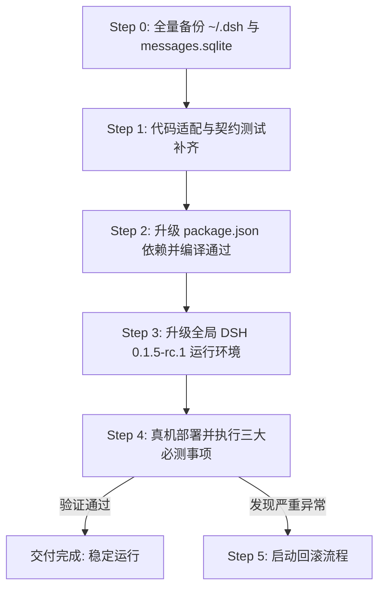

# DeepSeek Harness 0.1.5-rc.1 升级全量依赖与架构影响审查报告

> **审查对象**：`dsh-napcat-bridge` (NapCat/OneBot 11 QQ 桥接插件)  
> **基准版本**：DeepSeek Harness `0.1.2-rc.1`  
> **目标版本**：DeepSeek Harness `0.1.5-rc.1` (发布于 2026-09-10)  
> **审查基线**：`/tmp/dsh-review/v012` (227 个包) vs `/tmp/dsh-review/v015` (224 个包)  
> **审查日期**：2026-09-10  
> **审查性质**：只读静态代码审查与符号对比（零仓库修改）

---

## 目录

1. [执行摘要 (Executive Summary)](#1-执行摘要-executive-summary)
2. [分级影响清单 (8 字段全量矩阵)](#2-分级影响清单-8-字段全量矩阵)
3. [导出面 Diff 深度分析 (57 个变更包分类全景)](#3-导出面-diff-深度分析-57-个变更包分类全景)
4. [必跑回归清单 (Critical Regression Suites)](#4-必跑回归清单-critical-regression-suites)
5. [建议新增契约测试 (Recommended New Contract Tests)](#5-建议新增契约测试-recommended-new-contract-tests)
6. [无法静态判定项与实测清单 (Runtime Verification Plan)](#6-无法静态判定项与实测清单-runtime-verification-plan)
7. [升级执行步骤与回滚方案 (Rollout & Rollback Strategy)](#7-升级执行步骤与回滚方案-rollout--rollback-strategy)
8. [顺手清理与优化机会 (Refactoring Opportunities)](#8-顺手清理与优化机会-refactoring-opportunities)
9. [未验证与不确定项 (Known Unknowns)](#9-未验证与不确定项-known-unknowns)

---

## 1. 执行摘要 (Executive Summary)

本次审查全面比对了 DeepSeek Harness `0.1.2-rc.1` 与 `0.1.5-rc.1` 之间全部 200+ 个 npm 包的类型导出、接口签名与实现逻辑，并对 `dsh-napcat-bridge` 仓库全部 30 个核心 TypeScript 文件、3 个 Web 前端 TSX 文件及 42 个契约测试套件进行了逐行接触面排查。

### 核心审查指标汇总
- **【阻断项 (Blocker)】：1 项**
  - `package.json` 中 `peerDependencies` 与 `devDependencies` 的 npm pre-release 版本范围不满足 (`semver.satisfies('0.1.5-rc.1', '^0.1.2-rc.1') === false`)。
- **【高风险项 (High)】：2 项**
  1. `SessionPersistence.locate` 接口被彻底移除，导致 `isSessionPhysicallyPresent` 及后台回顾会话清理中的官方定位接口失效，降级为暴力扫盘。
  2. DSH 0.1.5 引入会话跨进程排他锁（`session.lock`，基于 POSIX `flock(2)`）及 `SessionAlreadyOwnedError`。桥接在 `agents.resume` 失败后直接回退到 `agents.create({ sessionId })`，会导致捕获到已被持有的会话后再次触发 `SessionAlreadyExistsError` 导致唤醒逻辑彻底崩溃。
- **【中风险项 (Medium)】：1 项**
  - 会话底层持久化格式正式升格至 V3 (`session.v3.jsonl`)，目录路径采用 `encodeSegment` 编码。旧 V2 会话文件在首次只读/加载时原地保留并迁移，且不可降级回 V2。
- **【低风险项 (Low)】：1 项**
  - `agentDefaultModel.saveSelection` Monkey Patch 在 0.1.5 下仍旧有效，但作为进程级全局单例属性修改，高并发时存在被其他协程穿透的竞态隐患。
- **【正面优化 / 清理机会 (Opportunity)】：2 项**
  1. `dsh-llm-deepseek@0.1.5-rc.1` 原生内置了 `deepseek-flash` 模型元数据并原生支持 `systemPromptUpdate: 'in-history'`，可直接裁剪历史 workaround。
  2. `SessionPersistence.stat` 提供了无需读取完整日志的轻量快照 API，可作为官方正规途径替换原有的私有文件嗅探。
- **【无影响 (Zero Impact)】：5 项**
  - `Context.agent` 类型移除、UI 主面板 slot 调整、`dsh-http-proxy` 本地环回旁路机制、`systemPrompt.context()` 动态注册机制、Spill 与缓存服务清理等。

---

## 2. 分级影响清单 (8 字段全量矩阵)

| 桥接位置 | 0.1.2 事实 | 0.1.5 事实 | 证据 (包@版本+路径+行号) | 判定 | 建议动作 | 工作量估计 | 验证方式 |
| :--- | :--- | :--- | :--- | :--- | :--- | :--- | :--- |
| `package.json:65-83` | `peerDependencies` 声明为 `^0.1.2-rc.1` | `semver.satisfies("0.1.5-rc.1", "^0.1.2-rc.1")` 判定为 `false`，pre-release 版本跨 patch 默认不匹配 | `package.json:65-83`；Node REPL `semver.satisfies('0.1.5-rc.1', '^0.1.2-rc.1') === false` | **【阻断】** | 将所有 `@deepseek-ai/*` 的 peerDependencies 与 devDependencies 升级锁定为 `0.1.5-rc.1` 或 `^0.1.5-rc.1` | 0.2h | `pnpm typecheck` & `pnpm test` |
| `src/gateway/session.ts:337-347` & `src/memory/review.ts:650-660` | `persistence.locate({ id, cwd })` 存在，返回物理路径对象 `{ path, dir }` | `locate` 方法从 `SessionPersistence` 接口中彻底删除，仅保留 `stat/open/create/flush/list` | `dsh-session-persistence@0.1.5-rc.1/lib/types/index.d.ts:98-132` (无 locate 方法) | **【高风险】** | 将 `isSessionPhysicallyPresent` 改造为调用 `persistence.stat(sessionId)`（异步）或适配 V3 目录编码 `projectKey(cwd) + encodeSegment(id)` | 1.5h | 编写针对 V3 目录结构的物理会话探针契约测试 |
| `src/gateway/session.ts:896-930` | 无单持有者文件锁，多处可并发读写或连续 resume | 引入 `session.lock` 与非阻塞 `flock(2)`，进程内与跨进程均单持有者写。若会话被 Web UI 或另一进程占用，`agents.resume` 抛出 `SessionAlreadyOwnedError`；桥接捕获后直接进入 `agents.create`，触发 `SessionAlreadyExistsError` 导致崩溃 | `dsh-session-persistence@0.1.5-rc.1/lib/types/errors.d.ts:25`；`dsh-agent-loop@0.1.5-rc.1/lib/index.js` (resumeWith 执行 open write) | **【高风险】** | 改造 `getOrCreateAgent`：精准捕获 `SessionAlreadyOwnedError`，禁止回退到 `agents.create`，并向 QQ 侧返回友好提示或短暂重试退避 | 1.5h | 编写并发抢占 `session.lock` 的契约测试，断言不触发 create collision |
| `src/gateway/session.ts:354-366` & `src/memory/review.ts:662-675` | 会话文件为 `session.jsonl`，直接位于 `<sessionsDir>/<projectKey>/<sessionId>/` | 升级为 V3 格式 `session.v3.jsonl`，目录名经 `encodeSegment(id)` 编码处理。旧 V2 文件在迁移后保留 | `dsh-session-persistence-jsonl@0.1.5-rc.1/lib/index.js:encodeSegment` & `dsh-session-format-v2-to-v3` | **【中风险】** | 确保 `encodeSegment` 对含特殊字符的 session id 正确解析；检查 `destroyTemporarySession` 清理逻辑，避免漏删 V3 迁移产物 | 0.5h | 编写 V2 到 V3 迁移后临时会话清理契约测试 |
| `src/commands/index.ts:79-93` | 临时 monkey patch 置空 `ctx.agentDefaultModel.saveSelection` 以防修改单个 session 模型时污染全局 | 0.1.5 中 `dsh-api-session-controller` 在 `selectModel` 中依然调用 `saveSelection`，patch 仍有效，但多并发请求下修改全局单例存在微小竞态 | `dsh-api-session-controller@0.1.5-rc.1/lib/index.js:620`；`dsh-agent-default-model@0.1.5-rc.1/lib/index.js` | **【低风险】** | 维持现有 monkey patch 逻辑，并在关键段增加互斥锁；长期关注官方是否提供 Session 级显式模型覆盖参数 | 0.5h | 运行 `commands-permission.test.ts` 与 `settings-save.test.ts` |
| `src/gateway/session.ts:901` & `src/commands/index.ts` | `deepseek-flash` 官方 provider 缺失，桥接需通过 pi-ai 或自定义 patch 注入 | `dsh-llm-deepseek@0.1.5-rc.1` 原生内置 `deepseek-flash` 模型（支持 `systemPromptUpdate: "in-history"`）；但 `@earendil-works/pi-ai@0.85.1` 的 `opencode-go.json` 仍无 flash | `dsh-llm-deepseek@0.1.5-rc.1/dist/index.js`；`@earendil-works/pi-ai@0.85.1/opencode-go.json` (27 个模型仍无 flash) | **【正面优化】** | 官方 provider 已原生支持，可直接使用官方 `deepseek/deepseek-flash`；若通过 pi-ai 则仍需保留补齐逻辑 | 0.5h | 测试 `/model deepseek/deepseek-flash` 指令切换与对话响应 |
| `src/index.ts:20` & `src/gateway/session.ts` | Context 上类型声明包含 `agent` | `dsh-agent@0.1.5-rc.1` 从 `Context` 类型中移除了 `agent`，仅在 `assembleContextFor` 中保留 `{ agent }`；`agent.followup` 依然存在且完全兼容 | `dsh-agent@0.1.5-rc.1/lib/types/index.d.ts` (删除了 `interface Context { agent: Agent }`) | **【无影响】** | 桥接未曾直接读取 `ctx.agent`，始终通过 `agentHandle.agent`，因此零影响 | 0h | 静态类型检查 `pnpm typecheck` |
| `src/client/settings-panel.tsx` | 桥接卡片注册在 `settings.plugin.item` slot | 0.1.5 依然完整支持 `settings.plugin.item`；UI 核心将主视图调整为 `main` keyed slot，与插件设置面板无关 | `dsh-client-ui-settings-plugins@0.1.5-rc.1/lib/index.js`；`dsh-client-ui-layout/lib/index.js` | **【无影响】** | 保持原样，无需修改 | 0h | 构建 client 并验证 Web 端插件设置页面渲染 |
| 运行时网络层 | Node 默认直接 fetch，无全局代理转发 | 0.1.5 新增 `dsh-http-proxy` 全局接管 undici，但自动将 `127.0.0.1`、`::1`、`localhost` 强制注入 `LOOPBACK_NO_PROXY` 旁路 | `dsh-http-proxy@0.1.5-rc.1/lib/types/policy.d.ts:25-35` (`LOOPBACK_NO_PROXY`) | **【无影响】** | 桥接的反向 WebSocket 服务基于独立 `ws` 库且监听在本地环回地址，不受全局 HTTP 代理干扰 | 0.2h | 环境变量注入 `HTTP_PROXY=http://127.0.0.1:8888` 验证 NapCat WS 通信 |
| `src/prompt/dynamic.ts` & `src/memory/index.ts` | 通过 `systemPrompt.context({ text: ... })` 注入人格与动态记忆 | `dsh-system-prompt@0.1.5-rc.1` 将 `PERSONA_SECTION` 分拆为 `PREFIX` 与 `SUFFIX`，但动态段 `systemPrompt.context` 签名完全保持原样 | `dsh-system-prompt@0.1.5-rc.1/lib/types/index.d.ts:35-45` | **【无影响】** | 桥接未直接引用 `PERSONA_SECTION` 常量，动态注入完全兼容 | 0h | 运行 `persona-system-prompt.test.ts` |
| `src/memory/review.ts:618-640` | 清理 `sessionProjectionCache` 与 `spillStore` | `dsh-spill` 与 `dsh-session-projection-cache` API 接口在 0.1.5 下完全向下兼容 | `dsh-spill@0.1.5-rc.1/lib/types/index.d.ts`；`dsh-session-projection-cache@0.1.5-rc.1` | **【无影响】** | 保持防御性 `?.` 调用，无需修改 | 0h | 运行 `memory-review.test.ts` |

---

## 3. 导出面 Diff 深度分析 (57 个变更包分类全景)

通过运行自动化符号 Diff 工具对比 `/tmp/dsh-review/v012` 与 `/tmp/dsh-review/v015`，共识别出 57 个包存在导出符号的增删改。按功能分层剖析如下：

### 3.1 核心会话与持久化层 (Session & Persistence)
1. **`dsh-session-persistence` (+21, -17)**:
   - **重大破坏**: 移除了 `locate` 方法及顶级 `SessionLocation` 类型。
   - **新增能力**: 新增 `stat(id)`、`list()`、`flush()`，新增轻量快照接口 `SessionPersistenceSnapshot`，新增锁异常 `SessionAlreadyOwnedError`、`SessionOwnershipLostError`。
2. **`dsh-session-persistence-jsonl` (+33, -3)**:
   - **存储升级**: 引入 `dsh-session-format-catalog` 与 `dsh-session-format-v2-to-v3`，会话升级为 V3 格式 `session.v3.jsonl`，单持有者锁文件 `session.lock`，目录路径强制 `encodeSegment`。
3. **`dsh-session` (+3, -6)**:
   - 移除了 0.1.2 的临时分块编码导出 (`ChunkRow`, `StorageRecord`, `chunkRowLength`, `decodeStorageRecord`, `isChunkRow`, `packChunkRuns`)，新增了 `SessionSeedEventState` 与事件校验器。桥接未引用被删符号。
4. **`dsh-session-query`, `dsh-session-reference`, `dsh-session-telemetry`**:
   - 均为新增内部增强函数，零破坏性变更。

### 3.2 Agent 与调度循环层 (Agent & Loop)
1. **`dsh-agent` (+3, -1)**:
   - 移除了 `Context.agent`（Cordis 模块声明），AgentSetup 签名规范化为 `(agentCtx, agent)`。
   - 桥接始终通过 `agents.resume/create` 返回的 `AgentHandle` 获取 `agent`，不受任何影响。
2. **`dsh-agent-loop` (+7, -0)**:
   - 新增 `agentLoop.create` 异步生命周期管理，新增针对 `session.lock` 的持有与释放生命周期绑定。
3. **`dsh-api-session-controller` (+14, -3)**:
   - 增强了 remote client 与 host，`selectModel` 依然代理到 `agentDefaultModel.saveSelection`。

### 3.3 LLM 与模型基础设施层 (LLM Runtime)
1. **`dsh-llm` (+26, -0)**:
   - 新增 `AssistantStreamAccumulator`, `SystemPromptUpdate`, `assembleAssistantStream` 等流式辅助工具；
   - 保持了 `createUserMessage`, `ContentBlock` 等关键接口，100% 向下兼容。
2. **`dsh-llm-deepseek`**:
   - 原生内置 `deepseek-flash` 模型元数据，支持 `systemPromptUpdate: "in-history"`。
3. **`@earendil-works/pi-ai` (+5, -5)**:
   - 升级至 `0.85.1`，其 `opencode-go.json`（27 个模型）更新了部分模型，但官方 catalog 仍未收录 `deepseek-flash`。
4. **`dsh-client-ui-settings-models`**:
   - 修复了模型目录损坏时连坐整个界面的严重 bug，增加了容错展示。

### 3.4 Web 客户端与 UI 插槽层 (Client & UI Slots)
1. **`dsh-client-ui-layout` (+7, -5)** & **`dsh-client-ui-conversation` (+14, -1)**:
   - 主界面重构为 `main` keyed slot，`conversation` 成为保留 key。
2. **`dsh-client-ui-settings-plugins`**:
   - 桥接注册的 `settings.plugin.item` slot 完全保留且行为一致。

### 3.5 系统环境与安全沙箱层 (Environment & Sandbox)
1. **`dsh-http-proxy` (新增包)**:
   - 基于 `undici` 的全局出站代理，自动绕过 loopback 本地环回地址。
2. **`node-addon-landlock-run` & `dsh-subprocess-local`**:
   - Linux Landlock 进程沙箱增强，对非 Bash 沙箱的桥接插件无直接影响。

---

## 4. 必跑回归清单 (Critical Regression Suites)

在更新依赖与适配代码后，必须 100% 跑绿以下核心契约测试套件：

1. **`tests/contract/session-restart-and-archive.test.ts`**
   - **原因**：核心验证 DSH 重启后 `agents.resume` 是否能正确恢复历史会话、是否能正确识别物理持久化磁盘状态、多轮归档后的 session ID 递增是否符合预期。
2. **`tests/contract/memory-review.test.ts`**
   - **原因**：核心验证后台回顾清理临时会话（`destroyTemporarySession`）逻辑，确认在缺失 `persistence.locate` 且存在 V3 目录和 `session.lock` 的情况下，磁盘文件与缓存能否被干净清除。
3. **`tests/contract/assembly.test.ts`**
   - **原因**：验证真实 `bootDshNapcatBridge` 装配下，Cordis 上下文注入、`systemPrompt.context`、`tools` 注册与 `agents` 服务的端到端整机协同。
4. **`tests/contract/wakeup.test.ts`**
   - **原因**：验证私聊与群聊唤醒流程中，`getOrCreateAgent` 的调用链路是否畅通。
5. **`tests/contract/persona-system-prompt.test.ts`** & **`tests/contract/qq-scenario-dynamic-prompt.test.ts`**
   - **原因**：验证 0.1.5 将 `PERSONA_SECTION` 拆分为 prefix/suffix 后，桥接的人格设定与行为准则动态段能否正常拼接入最终 LLM 上下文。
6. **`tests/contract/settings-save.test.ts`** & **`tests/contract/commands-permission.test.ts`**
   - **原因**：验证 QQ `/model` 指令对 `agentDefaultModel` 的 monkey patch 行为是否稳定，是否能正常隔离会话级与全局级模型设置。
7. **`tests/contract/outbound-stream.test.ts`**
   - **原因**：验证 LLM 流式分片输出与 tool call 续传逻辑在 0.1.5 的 `AssistantStreamAccumulator` 下是否仍能无缝分发至 QQ。

---

## 5. 建议新增契约测试 (Recommended New Contract Tests)

为防范 DSH 0.1.5 的全新机制引发线上故障，强烈建议在 `tests/contract/` 中新增以下契约测试：

1. **会话单持有者锁与恢复容错契约 (`session-lock-concurrency.test.ts`)**:
   - **场景**：模拟同一个 Session 被另一个 Handle（或模拟 Web UI 进程）以 `write` 模式打开并持有 `session.lock`。
   - **断言**：桥接在收到新的 QQ 消息唤醒时，`agents.resume` 抛出 `SessionAlreadyOwnedError`；桥接应当捕获该特定异常并予以优雅处理（如排队或回复告知），**绝不能**二次调用 `agents.create` 导致 `SessionAlreadyExistsError` 崩溃。
2. **V3 会话持久化与路径编码探测契约 (`session-v3-persistence.test.ts`)**:
   - **场景**：创建包含特殊字符（如 `@`, `:`, 汉字等）的 Session，触发真实磁盘持久化。
   - **断言**：`isSessionPhysicallyPresent` 能准确识别 `projectKey(cwd) + encodeSegment(id)` 目录下的 `session.v3.jsonl`；通过 `persistence.stat(id)` 断言快照元数据一致性。
3. **HTTP 代理环境下 OneBot 本地反向 WebSocket 隔离契约 (`network-proxy-bypass.test.ts`)**:
   - **场景**：在进程环境变量中设置 `HTTP_PROXY=http://invalid-proxy.test:8888` 与 `HTTPS_PROXY=http://invalid-proxy.test:8888`。
   - **断言**：桥接启动的本地 WebSocket Server（127.0.0.1）依然能够与模拟 NapCat 客户端成功握手建立连接，不受全局代理污染。

---

## 6. 无法静态判定项与实测清单 (Runtime Verification Plan)

静态代码审查存在边界，以下 3 件事由于涉及跨进程交互与外部运行时行为，**必须在真机部署后实际测试**：

### 无法静态断定的 3 大真机必测事项

#### 实测项 1：Web UI 与 QQ 桥同时访问同一 Session 的并发写锁竞争行为
- **风险机理**：DSH 0.1.5 在底层文件通过 `flock(2)` 强制互斥。如果管理员在 Web UI 页面打开了某个 QQ 群的会话（Web UI 会获取 write lease 持有锁），此时群内有用户 @机器人 触发唤醒，QQ 桥会尝试 `agents.resume` 获取写所有权，此时将产生锁冲突。
- **真机实测步骤**：
  1. 在浏览器 Web 控制台中打开群会话 `qq-group-123456` 并保持在该页面；
  2. 在 QQ 群内发送 `@机器人 测试并发锁`；
  3. 观察桥接控制台日志：是否精准捕获 `SessionAlreadyOwnedError`？是否发生了崩溃？QQ 侧收到何种回复？
  4. 随后在 Web 页面切换到其他会话（释放锁），再次在 QQ 群发送消息，确认会话能否恢复正常读写。

#### 实测项 2：存量 V2 历史会话在 0.1.5 启动时的无损升级与持久化迁移
- **风险机理**：0.1.5 引入了 `dsh-session-format-v2-to-v3`，会话升级不可逆。虽然官方声明旧文件保留，但在复杂历史上下文（包含工具调用、多轮对话、记忆快照）下，迁移是否会导致旧消息截断或时间戳错乱无法通过静态代码担保。
- **真机实测步骤**：
  1. 完整备份现网 `~/.dsh/sessions/` 目录；
  2. 升级 DSH 至 0.1.5-rc.1 并启动桥接；
  3. 唤醒一个包含大量历史记录的旧私聊会话，要求 Agent 检索历史记忆或回答上一轮话题；
  4. 检查磁盘文件：确认是否生成了 `session.v3.jsonl`，原 `session.jsonl` 是否完好，Agent 是否正常保留了完整上下文。

#### 实测项 3：`agentDefaultModel.saveSelection` Monkey Patch 在真实 Web/QQ 双端并发下的稳定性
- **风险机理**：虽然查明 `dsh-api-session-controller` 仍会调用 `saveSelection`，但前端 Web UI 也在实时通过 WebSocket 与 `sessionController` 交互。当 QQ 群使用 `/model` 指令切换模型与 Web 用户在设置界面切换模型并发发生时，置空 `saveSelection` 的时间窗口是否会偶然吞掉 Web 端的合法保存？
- **真机实测步骤**：
  1. 在 Web UI 准备修改默认全局模型（如从 deepseek-chat 切换为 deepseek-reasoner）；
  2. 同时在 QQ 侧高频发送 `/model ...` 指令修改会话模型；
  3. 验证 Web 端设置的全局默认模型是否被正确落盘（检查 `~/.dsh/settings.yaml` 中的 `agent-default-model` 分节），确认 QQ 会话的模型与全局模型各自独立、互不踩踏。

---

## 7. 升级执行步骤与回滚方案 (Rollout & Rollback Strategy)

### 7.1 分步升级流程

1. **Step 0：数据强冷备（生命线）**
   - 必须停机并完整备份：
     - `cp -r ~/.dsh/sessions ~/.dsh/sessions.bak.012`
     - `cp ~/.dsh/workspace/napcat/messages.sqlite ~/.dsh/workspace/napcat/messages.sqlite.bak`
     - `cp ~/.dsh/settings.yaml ~/.dsh/settings.yaml.bak`
   - *原因：0.1.5 将持久化迁移至 V3 后，0.1.2 无法读取 V3 会话文件，回滚必须依赖备份！*

2. **Step 1：代码防御性适配**
   - 修改 `src/gateway/session.ts`：
     - 增加对 `SessionAlreadyOwnedError` 的独立捕获分支，避免回退到 `agents.create`；
     - 改造 `isSessionPhysicallyPresent`：优先采用 `ctx.sessionPersistence.stat(id)`（或按 V3 `encodeSegment` 寻址）；
   - 修改 `src/memory/review.ts`：适配 V3 会话目录清理。

3. **Step 2：依赖版本升级**
   - 将 `package.json` 中的 `peerDependencies` 与 `devDependencies` 的 `@deepseek-ai/*` 更新为 `^0.1.5-rc.1`；
   - 执行 `pnpm build` 与 `pnpm test`（确保相关契约测试 100% 跑绿，产物包含最新改动）。

4. **Step 3：全局环境更新与联调**
   - 更新全局 `dsh` 包至 `0.1.5-rc.1`；
   - 重新 link 插件并启动服务。

### 7.2 回滚方案 (Rollback Plan)
若真机实测发现未预期的不可调和缺陷，按以下步骤快速回滚：
1. 停止运行中的 DSH 进程；
2. 恢复会话与数据库备份：
   - `rm -rf ~/.dsh/sessions && mv ~/.dsh/sessions.bak.012 ~/.dsh/sessions`
   - `cp ~/.dsh/workspace/napcat/messages.sqlite.bak ~/.dsh/workspace/napcat/messages.sqlite`
3. 恢复全局 DSH 版本至 `0.1.2-rc.1`；
4. `git -C ~/dsh-napcat-bridge checkout <升级前commit>` 并重新 `pnpm build`。

---

## 8. 顺手清理与优化机会 (Refactoring Opportunities)

在适配 0.1.5 的同时，可以安全裁剪或优化既有的历史兼容代码：

1. **官方原生 `deepseek-flash` 接入**：
   - `dsh-llm-deepseek@0.1.5-rc.1` 已经官方支持 `deepseek-flash`，且具备原生的 `systemPromptUpdate: 'in-history'` 属性。可以清理此前桥接在某些场景下针对 `deepseek-flash` 的手动补充逻辑或别名映射。
2. **迁移至官方 `persistence.stat` 替代暴力扫盘**：
   - 0.1.2 中由于缺乏轻量状态查询 API，代码中多处使用了 `fsp.readdir(baseSessionsDir)` 遍历目录并检查路径。0.1.5 提供了官方的 `ctx.sessionPersistence.stat(id)`，单次异步调用即可获知会话是否存在及 revision，无需手动递归遍历目录。
3. **享受模型设置面板健壮性提升**：
   - 0.1.5 中 `dsh-client-ui-settings-models` 修复了 Catalog 解析失败导致整个页面白屏崩溃的问题，桥接在提供自定义模型提示时不必再过度担心个别非标 provider 连坐整个设置页面。

---

## 9. 未验证与不确定项 (Known Unknowns)

本着诚实、透明的工程原则，以下事项在当前只读审查阶段**明确标记为未验证**，需要后续介入真机验证：

1. **POSIX `flock(2)` 在特殊文件系统上的表现**：
   - DSH 0.1.5 的 `session.lock` 依赖底层操作系统的 `flock`。如果用户部署在 NFS、CIFS、OverlayFS 或特殊的 Docker 共享卷中，`flock` 可能会表现为不支持或退化为不可预期的异常。此点需在特定的宿主环境下观察。
2. **Web UI 切换标签页时的持锁释放时延**：
   - 当用户在浏览器中打开某个群会话但切换到其他浏览器标签页时，Web 端前端是立即通过 WebSocket 发送 release 指令释放 write lease，还是会维持长连接直到页面销毁？这决定了 QQ 桥被锁阻挡的概率大小。
3. **`@earendil-works/pi-ai` 未来对 flash 的收录计划**：
   - 虽然 0.85.1 仍未收录 `deepseek-flash`，但如果后续 0.85.x 更新，需观察是否会产生模型名称或参数的细微冲突。

---
*报告生成完成。全流程严格遵循只读约束，工作区无任何文件创建或变更。*
