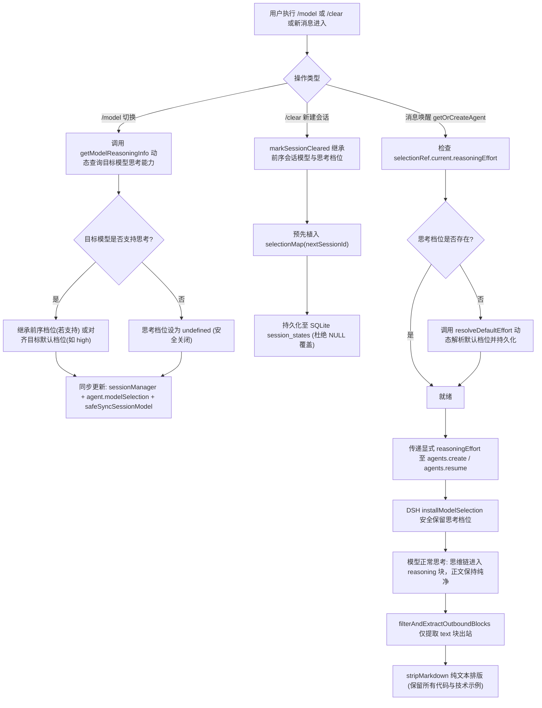

# 踩坑考证：模型思考关闭导致思维链泄漏根因分析与系统治理

> **归档日期**：2026-09-10  
> **关联分支**：`feat/ab-test-direct-stream-reply`  
> **关键涉及模块**：[`src/commands/index.ts`](file:///home/nyara/dsh-napcat-bridge/src/commands/index.ts)、[`src/gateway/session.ts`](file:///home/nyara/dsh-napcat-bridge/src/gateway/session.ts)、[`src/outbound/render.ts`](file:///home/nyara/dsh-napcat-bridge/src/outbound/render.ts)、[`src/outbound/stream.ts`](file:///home/nyara/dsh-napcat-bridge/src/outbound/stream.ts)

---

## 1. 现象与排查背景

在 QQ 对话交互中，偶发出现模型在正文回复中直接输出自己的推理演进、规划过程（Chain-of-Thought, CoT），例如：
- 伴随工具调用的前置步骤中，正文输出了模型的推理旁白；
- 甚至在最终回复中，模型将分析思路直接写在了文本第一段，宛如把思维链暴露在了正文里。

用户通过多轮 AB 测试排查并定位到核心规律：
1. **根因表现**：当模型内部思考模式被关闭（`thinking: false` 或无 `reasoningEffort`）时，模型失去了独立的思考输出通道，习惯性地直接在 `content` 的 `text` 块内展开前置推理；
2. **高发诱因**：
   - **重灾区 1**：在对话中途使用 `/model` 切换模型；
   - **重灾区 2**：通过 `/clear` 或 `/new` 新建会话；
3. **临时缓解**：手动使用 `/think <档位>` 显式设定一次思考深度，或者反复新建会话，能概率性恢复正常。

---

## 2. 深度代码根因剖析（DSH 架构与 Bridge 状态机）

通过深入查验 DSH 核心包（`@deepseek-ai/dsh-agent`）源码及项目内部状态流转，确认了三大环环相扣的技术根因：

### 2.1 根因一：DSH Agent-Loop 拦截器主动剥离未显式声明的 `reasoningEffort`

查验 `node_modules/@deepseek-ai/dsh-agent/lib/index.js` 中的 `installModelSelection` 机制：

```javascript
// @deepseek-ai/dsh-agent/lib/index.js
const disposeRequest = agentCtx.on("agent/request", async (_payload, next) => {
    const resolved = await next();
    const selected = selection.assembled;
    if (selected === void 0) return resolved;
    
    // 关键陷阱代码：
    const { reasoningEffort: _inheritedEffort, ...withoutInheritedEffort } = resolved;
    return {
        ...withoutInheritedEffort,
        provider: selected.provider,
        model: selected.model,
        ...selected.reasoningEffort === void 0 ? {} : { reasoningEffort: selected.reasoningEffort }
    };
});
```

- **执行机理**：DSH 在每次向 LLM 发起会话请求（`agent/request`）前，都会由 `installModelSelection` 解析模型配置。
- **致命陷阱**：如果会话的 `selected.reasoningEffort === undefined`，该拦截器不仅不会采用 `resolved` 中的继承值，反而通过解构**强行把 `_inheritedEffort` 从配置中剔除**！
- **旧版实现缺陷**：原 `/model <provider/model>` 指令仅提取并更新了 `provider` 和 `model`，传递的 `reasoningEffort` 始终为 `undefined`。一旦用户在对话中执行 `/model`，整个会话的思考深度被瞬间清空，DSH 下发的 LLM 请求参数中不再包含 `reasoningEffort`，直接导致模型内部思考被关闭。

---

### 2.2 根因二：Session 状态持久化与新建会话丢弃配置

在 `src/gateway/session.ts` 的会话生命周期管理中存在状态断链与数据库擦除：

1. **SQLite `INSERT OR REPLACE` 覆盖清空**：
   `session_states` 表使用了 `INSERT OR REPLACE INTO session_states`。在旧版 `markSessionCleared`（处理 `/clear` / `/new`）、`peerToSessionId`（会话寻址）以及 `resumeSession` 中调用 `saveSessionState` 时，漏传了 `model_provider`、`model_name` 和 `model_reasoning_effort`。这导致 SQLite 执行 REPLACE 时，直接将原本已落位的模型及思考档位覆盖重置为 `NULL`。
2. **新 Session 缺少配置预植入**：
   `/clear` 推进会话版本号并生成 `nextSessionId` 时，内存中的 `selectionMap` 未同步为该 `nextSessionId` 初始化模型引用，导致后续唤醒重新退回到默认状态。
3. **Agent 初始化缺省保底缺失**：
   在 `getOrCreateAgent` 恢复或新建 Agent 时，若内存配置中 `reasoningEffort` 为 `undefined`，未主动向 DSH `llm.resolveModelInfo` 查询该模型的默认思考档位，导致传给 `agents.create` / `agents.resume` 的 `agentOptions` 缺少 `reasoningEffort`。

---

### 2.3 根因三（重要反思）：为什么严禁用文本层（`stripMarkdown`）粗暴正则过滤 `<think>`？

在排查初期，曾有人提议或尝试在出站文本渲染层 [`src/outbound/render.ts`](file:///home/nyara/dsh-napcat-bridge/src/outbound/render.ts) 中通过正则表达式剥离 `<think>...</think>` 及未闭合的 `/<think.*$/`。**但经严谨考证与用户警示，这种做法存在灾难性的技术漏洞与严重误伤**：

1. **代码块被严重破坏掏空**：
   如果用户向模型请教技术问题（例如：“请给我写一个 DeepSeek API 的 prompt 思考链示例”），模型在 Markdown 代码块（```xml ... ```）中输出了 `<think>示例内容</think>`，全局正则会把代码块内部的代码无差别当成思维链删除，导致用户收到空代码块；
2. **正文截断吞噬灾难**：
   如果模型在正文或行内代码中仅仅是解释说明提到了“可以使用 `<think>` 标签”（未闭合），未闭合匹配正则 `/<think(?:\s[^>]*)?>[\s\S]*$/` 会**从 `<think>` 开始直接吞噬整条消息到末尾的所有字符**，造成大段正文凭空蒸发；
3. **违背架构设计哲学**：
   本项目 [`src/outbound/render.ts`](file:///home/nyara/dsh-napcat-bridge/src/outbound/render.ts) 的根本契约哲学为**「误伤防护（宁可少剥，不可误伤）」**。
   - 在 DSH 架构中，思考过程原本就被规范化为独立的内容块类型 `type: 'reasoning'`；
   - 出站通道 [`filterAndExtractOutboundBlocks`](file:///home/nyara/dsh-napcat-bridge/src/outbound/stream.ts#L21) 天然只提取 `type: 'text'` 块；
   - **只要从源头保证思考模式正确开启，思维链在系统底层就是完全与正文隔离的，根本不需要、也不应该在渲染输出层施加高危且粗暴的文本正则**。

---

## 3. 系统级治理方案

针对上述根因，在代码层面进行了系统化端到端修复：



### 3.1 `/model` 动态解析与档位继承

在 [`src/commands/index.ts`](file:///home/nyara/dsh-napcat-bridge/src/commands/index.ts) 中：
- 切换前通过 `getModelReasoningInfo(ctx, targetProvider, targetModel, curEffort)` 探查目标模型；
- 若支持思考：
  - 前序有设置且目标模型支持该档位时，自动继承（如 `low` 继承为 `low`）；
  - 否则自动对齐为目标模型的官方默认档位（如 `high`）；
- 将决定的 `targetEffort` 同步透传至 `sessionManager.setNapcatDefaultModel`、`sessionManager.setModelSelection`、`(agent as any).modelSelection.current` 以及 `safeSyncSessionModel`（调用 DSH 宿主 `sessionController.selectModel`）；
- 在 QQ 回复中给出明确的思考状态反馈（例如：`🧠 思考深度：已自动对齐为 low (Low) (继承前序设置)`）。

### 3.2 会话状态全生命周期继承与防丢失

在 [`src/gateway/session.ts`](file:///home/nyara/dsh-napcat-bridge/src/gateway/session.ts) 中：
- `peerToSessionId`、`markSessionCleared` 与 `resumeSession` 全面改写，在写数据库前先读取现存状态，严禁以 `NULL` 覆盖已有的 `model_provider`、`model_name` 与 `model_reasoning_effort`；
- `markSessionCleared` 生成新版本 `nextSessionId` 时，主动继承前序会话的模型与档位，并预先登记到 `this.selectionMap.set(nextSessionId, ...)`；
- 新增 `resolveDefaultEffort` 方法：在 `getOrCreateAgent` 启动或恢复 Agent 时，若检测到 `reasoningEffort` 为空，自动动态查询 `llm.resolveModelInfo` 解析默认档位，并在 `agents.create` 和 `agents.resume` 的 `agentOptions` 中显式指定。

### 3.3 坚守「误伤防护」原则

在 [`src/outbound/render.ts`](file:///home/nyara/dsh-napcat-bridge/src/outbound/render.ts) 中：
- 彻底移除对 `<think>` 标签的正则表达式替换；
- 保障所有包含 `<think>` 的代码块、技术指引、XML/Markdown 示例 100% 完整原样展示；
- 在 [`tests/contract/strip-markdown.test.ts`](file:///home/nyara/dsh-napcat-bridge/tests/contract/strip-markdown.test.ts) 中确立反误伤契约测试。

---

## 4. 验收与回归契约

本次治理已建立完备的自动化契约测试网（全量通过）：

| 测试套件 | 契约项 | 验证内容 |
| :--- | :--- | :--- |
| [`tests/contract/commands-permission.test.ts`](file:///home/nyara/dsh-napcat-bridge/tests/contract/commands-permission.test.ts) | **契约 14** | `/model` 切换模型时自动动态解析并继承/对齐思考深度，并在回复中呈现对齐状态 |
| [`tests/contract/commands-permission.test.ts`](file:///home/nyara/dsh-napcat-bridge/tests/contract/commands-permission.test.ts) | **契约 15** | `/clear` 开启新会话时继承原会话的模型与思考深度，且新 session 预先植入 `selectionMap` |
| [`tests/contract/strip-markdown.test.ts`](file:///home/nyara/dsh-napcat-bridge/tests/contract/strip-markdown.test.ts) | **技术示例反误伤契约** | 代码块中的 `<think>...</think>` 完整保留；正文中未闭合的 `<think>` 提及不截断后续正文 |
| [`tests/contract/ab-test-direct-stream.test.ts`](file:///home/nyara/dsh-napcat-bridge/tests/contract/ab-test-direct-stream.test.ts) | **契约 1 ~ 3** | AB 测试分支直发模式下，正文与思考块分离完整流出，工具列表纯净 |

---

## 5. 总结与开发手记

1. **不要在后处理层（Post-processing）试图用正则猜测语义**：
   试图在排版渲染层通过正则清洗本应由底层协议隔离的内容，往往会带来意想不到的代码块掏空、正文截断等恶性 bug。
2. **深挖 DSH 机制的“默认剥离”逻辑**：
   DSH 的 `installModelSelection` 在 `reasoningEffort === undefined` 时会隐式将请求参数降级。在集成任何模型选择服务时，必须保证 `reasoningEffort` 的生命周期同步完整。
3. **全链路状态持久化注意 `INSERT OR REPLACE` 陷阱**：
   SQLite 中的 `INSERT OR REPLACE` 行为等同于 `DELETE + INSERT`。如果状态保存时只传了部分字段，未传字段会被全量重置为默认值或 `NULL`。必须保证多字段更新时的状态全量合并。
