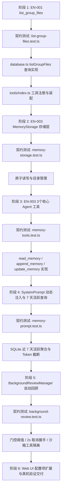

# DSH × NapCat 群文件列表工具 (EN-001) 与两层记忆体系插件 (EN-003) 调研与技术设计方案

> **文档性质**：技术调研、限制评估与架构设计方案（呈交用户审查）  
> **文档位置**：`docs/DSH-NapCat-群文件列表与两层记忆体系-调研与设计方案.md`  
> **关联 Issue**：`DshNapcat-Issue-List.md` 中的 EN-001 [中] 与 EN-003 [高]（低优先级 EN-002 暂缓）

---

## 1. 调研背景与任务边界

根据用户需求与 Issue 清单，本次调研聚焦于以下两项核心功能：
1. **EN-001 [中] `list_group_files` 群文件列表工具**：让 Agent 能够按多维条件检索当前群聊中已上传的群文件元数据，进而联动现有的 `fetch_chat_resource` 完成按需下载；
2. **EN-003 [高] Memory 插件 — Session 记忆 + User Profile（两层记忆体系）**：从 `nyagent` 记忆插件移植并适配 QQ 群聊/私聊多用户场景，实现轻量 Markdown 持久化、动态 System Prompt 注入、主动/被动记录以及后台自动回顾（Background Review）。
3. **EN-002 [低] `send_file` 支持 URL 图片直接发送**：按用户指示，低优先级**暂缓实施**。

经过深入查阅 `dsh-napcat-bridge` 本地源码、`nyagent` 记忆与自动回顾实现 (`/home/nyara/nyagent/src/plugins/memory`)、Hermes 后台回顾源码 (`~/.hermes/hermes-agent/agent/background_review.py`) 以及 OneBot v11 协议标准，现将两项任务的可行性、限制条件及详细设计方案汇报如下。

---

## 2. EN-001：`list_group_files` 群文件列表工具深度调研与方案

### 2.1 现状与痛点分析
- **现状**：当群员在群聊上传文件时，NapCat 推送 `notice_type: 'group_upload'` 事件，插件将其转换为 `type: 'group_file'` 记录写入 SQLite `messages` 表，包含 `file_id`（UUID）、`busid`、`content: '[群文件:xxx (ID:uuid)]'` 及 `raw`（完整 JSON）。
- **痛点**：Agent 目前仅能通过 `read_chat_history` 在海量文本中偶然翻到群文件通知。如果用户提问“群里有哪些技术文档”或“帮我查一下上周发的表格”，Agent 无法直接获取结构化的群文件清单，进而无法提取 `file_id` 与 `busid` 调起 `fetch_chat_resource`。

### 2.2 可做性评估与边界限制（如实上报）

| 评估维度 | 结论 | 详细说明 |
| :--- | :---: | :--- |
| **可做性** | **100% 可做** | 依赖的 SQLite 数据表结构已具备 `type='group_file'`、`file_id`、`busid`、`raw`、`time` 等字段，`defineTool` 机制成熟。 |
| **数据源选型** | **SQLite 本地消息表 (推荐)** | **对比 NapCat 在线 API (`get_group_root_files`)**：<br>1. NapCat 的 `get_group_root_files` 是 QQ 官方群空间目录树，返回结构深、无群聊上下文时间线关联；<br>2. SQLite 检索速度快（<1ms）、离线可用、支持自然时间与发送者多维筛选，且与 `read_chat_history` 过滤逻辑完美对齐。 |
| **限制 1：历史存量边界** | **存在限制** | 仅能检索**机器人入群且在线期间**捕获到的 `group_upload` 文件；在机器人离线或入群前上传的文件不会记录在 SQLite 中。 |
| **限制 2：`sender_name` 存量数据** | **需做平滑兼容** | 既往代码在处理 `group_upload` 时将 `sender_name` 写入了 `''`。修复方案：增量写入时调用 `memberManager.getMemberName` 补全昵称；存量查询时若 `sender_name` 为空则回退显示 `user_id`。 |
| **限制 3：`file_name` 提取** | **解析提取** | 消息表中文件名保存在 `raw` JSON (`event.file.name`) 及 `content` 中，查询时通过轻量解析输出标准化 `file_name` 字段，支持按文件名/关键词模糊搜索。 |
| **限制 4：私聊调用防护** | **优雅防御** | 若 Agent 在私聊（`user_<qq>`）误调该工具，返回友好提示“当前为私聊会话，无群文件记录，私聊文件请使用 read_chat_history(type='file')”。 |

### 2.3 详细技术设计

#### 2.3.1 数据库查询方法 `MessageDatabase.listGroupFiles`
在 `src/storage/database.ts` 中新增方法：
```ts
export interface ListGroupFilesParams {
  limit?: number;        // 默认 20，最大 100
  since?: string | number; // 起始时间（支持时间戳、相对时间 '7d'、自然日期 '2026-08-30'）
  until?: string | number; // 截止时间
  sender_name?: string;  // 上传者昵称/群名片模糊搜索
  user_id?: string;      // 上传者 QQ 精确筛选
  file_name?: string;    // 文件名模糊搜索（别名 keyword）
  order?: 'asc' | 'desc'; // 时间排序，默认 'desc' 倒序
}

export interface GroupFileInfo {
  msg_id: number;
  file_id: string;
  file_name: string;
  busid: number;
  sender_name: string;
  user_id: string;
  time: number;
  formatted_time: string;
  size?: number;
}

export interface ListGroupFilesResult {
  files: GroupFileInfo[];
  total: number;
}
```

#### 2.3.2 Agent 工具声明与执行
在 `src/tools/index.ts` 中通过 `defineTool` 注册 `list_group_files`：
```ts
defineTool({
  name: 'list_group_files',
  description: '获取当前群聊的历史上传文件列表。返回包含文件名、上传者、时间、file_id 和 busid 的清单。获取到所需文件的 file_id 和 busid 后，可调用 fetch_chat_resource 工具进行下载。',
  parameters: {
    file_name: { type: 'string', description: '按群文件名模糊搜索（如 ".pdf", "周报"）' },
    sender_name: { type: 'string', description: '按上传者昵称或群名片模糊搜索' },
    user_id: { type: 'string', description: '按上传者 QQ 号精确筛选' },
    since: { type: 'string', description: "起始时间：支持相对时间 (如 '7d', '2w') 或自然日期 (如 '2026-08-25')" },
    limit: { type: 'number', description: '返回最大数量 (默认 20，上限 100)' },
    order: { type: 'string', enum: ['asc', 'desc'], description: "排序方式 (默认 'desc' 倒序，取最新上传的文件)" }
  },
  output: {
    schema: { type: 'json' },
    render: (_args, value) => [
      {
        type: 'text',
        text: renderGroupFilesText(value) // 格式化为易读的 Markdown 列表
      }
    ]
  },
  async execute(args, exec) {
    const session = (exec.agent as any)?.session;
    const rawPeer = session?.id || '';
    const peer = normalizePeer(rawPeer);
    if (!peer.startsWith('group_') && !peer.startsWith('qq-group-')) {
      return { files: [], total: 0, error: '当前会话不是群聊，无群文件记录' };
    }
    return db.listGroupFiles(peer, args);
  }
})
```

---

## 3. EN-003：Memory 插件（Session 记忆 + User Profile 两层体系）深度调研与方案

### 3.1 架构选型与重大设计决策（对齐 Issue 指导原则与用户拍板）

```
                     ┌────────────────────────────────────────┐
                     │          Web UI / 全局提示词           │
                     │  (persona/behavior 覆盖全局，不设全局层) │
                     └────────────────────────────────────────┘
                                          │
                     ┌────────────────────┴───────────────────┐
                     ▼                                        ▼
    ┌──────────────────────────────────┐   ┌──────────────────────────────────┐
    │       第一层：Session 记忆        │   │       第二层：User Profile       │
    │         (per-peer 维度)          │   │         (per-QQ号 维度)          │
    │  .dsh/napcat/napcat_memory/      │   │  .dsh/napcat/napcat_memory/      │
    │  ├── session/                    │   │  └── user/                       │
    │  │   ├── group_3000000001.md     │   │      ├── 2000000001.md           │
    │  │   └── user_2000000001.md      │   │      ├── 470250799.md            │
    │  └── (记录：群规、主题、话题禁忌)  │   │      └── default.md (兜底画像)   │
    │                                  │   │  (记录：用户职业、性格、称呼偏好)  │
    └──────────────────────────────────┘   └──────────────────────────────────┘
```

1. **砍掉全局规则层**：
   - QQ 群聊是多用户异构场景，不存在单一“主人”。全局设定已由 Web UI 的 `persona` 和 `behavior` 动态注入，无需引入重复且易冲突的全局 `MEMORY.md`。
2. **两层记忆清晰划分**：
   - **Session 记忆 (`session/<peer>.md`)**：与聊天场景绑定。群聊记录群主题、群氛围、特定规则；私聊记录该私聊会话的专属约定。
   - **User Profile (`user/<qq>.md`)**：与具体 QQ 用户绑定。无论该用户在哪个群发言或私聊，其画像在全系统通用。
3. **纯 Markdown 文件存储（非 SQLite）**：
   - 默认存储路径定位于 **`.dsh/napcat/napcat_memory/`**（支持 Web UI 灵活覆盖）；
   - 方便管理员与用户直接打开查看、人工修正、版本备份；
   - 采用原子写入机制（`atomicWriteFile`），写临时文件后 `rename`，杜绝并发损坏。
4. **用户发现与注入策略（7 天活跃机制 + 2200 字符原子画像边界截断）**：
   - **群聊场景**：不建沉重冗余的用户注册表。通过 SQLite 聚合查询群内近 7 天发言活跃用户：
     ```sql
     SELECT user_id, sender_name, MAX(time) as last_active 
     FROM messages 
     WHERE peer = ? AND self = 0 AND time >= ?
     GROUP BY user_id 
     ORDER BY last_active DESC 
     LIMIT 10;
     ```
     仅读取活跃用户的 `user/<qq>.md` 注入；
   - **私聊场景**：天然仅 1 位人类用户，直接全量加载 `user/<qq>.md`，**不受 7 天活跃度筛选限制**；
   - **7 天 ≠ 删文件**：7 天未发言仅在群聊 System Prompt 中暂不注入以省 Token，**文件永久保留**，一旦再次发言立即自动激活注入；
   - **原子完整性截断保护（关键红线）**：
     - 群聊画像 Token 预算放宽至 **2200 字符**；
     - **原子截断规则**：遍历活跃用户画像时，若累积字符数达到或突破 2200 上限，**必须将当前这名用户的画像完整保留**，绝不在句子中间或 Markdown 结构中断裂截断；当前用户画像完整放入后，立即停止追加后续用户画像。

### 3.2 可做性评估与边界限制（如实上报）

| 评估维度 | 结论 | 详细说明 |
| :--- | :---: | :--- |
| **可做性** | **100% 可做** | `nyagent` 的存储封装、工具定义与 Hermes 后台回顾状态机均可直接复用与适配。 |
| **KV Cache 安全性** | **完全保证** | 注入走 `systemPrompt.context({ name: 'napcat:memory', order: 40 })`，位于静态 System Prompt 之后。每轮动态重算，更新后立即在下一轮生效。 |
| **并发与前台延迟** | **2 秒超时取消握手** | 继承 Hermes `_BackgroundReviewRun` 握手协议，当用户新消息触发 `turn/start` 时，在 2.0s 内发送中断信号并解包，**绝不阻塞前台对话生成**。 |
| **写保护约束 (Hermes 对齐)** | **严格继承** | 提示词完全继承 Hermes 原文精髓，内置 5 大禁忌：禁止记录环境配置瞬态错误、禁止记录工具负面断言、禁止记录单次任务流水账、禁止记录未解决的试错死胡同。 |
| **Token 上限保护** | **原子画像熔断** | 设置上限为 **2200 字符**，遵循“放完整当前用户，丢弃后续用户”的原子边界保护原则。 |

---

### 3.3 详细技术设计

#### 3.3.1 存储模块 `MemoryStorage`
文件目录布局：
```
.dsh/napcat/napcat_memory/
├── session/
│   ├── group_3000000001.md
│   └── user_2000000001.md
└── user/
    ├── 2000000001.md
    ├── 470250799.md
    └── default.md
```
核心方法：
- `readSessionMemory(peer: string): Promise<string>`
- `writeSessionMemory(peer: string, content: string): Promise<void>`
- `appendSessionMemory(peer: string, note: string): Promise<void>`
- `readUserProfile(qq: string): Promise<string>`
- `writeUserProfile(qq: string, content: string): Promise<void>`
- `appendUserProfile(qq: string, note: string): Promise<void>`
- `getPromptSnapshot(peer: string, activeUsers: { qq: string; name: string }[], maxBudget = 2200): Promise<string>`

#### 3.3.2 3 个统一 Agent 工具定义
收敛并统一工具参数，兼顾 Agent 主动记忆与后台回顾自动更新：

| 工具名称 | 参数签名 | 行为说明 |
| :--- | :--- | :--- |
| **`read_memory`** | `type: 'session' \| 'user'`, `qq?: string` | `type='session'` 读取当前群/私聊规则；`type='user'` 读取指定 QQ（默认当前提问者）画像。 |
| **`append_memory`** | `type: 'session' \| 'user'`, `content: string`, `qq?: string` | 以时间戳条目追加记录（如 `- [2026-09-01] 用户喜欢简洁回复`）。 |
| **`update_memory`** | `type: 'session' \| 'user'`, `content: string`, `qq?: string` | 全量更新重写指定 Session 规则或用户画像 Markdown。 |

#### 3.3.3 System Prompt 动态段组装效果
在 `src/prompt/dynamic.ts` 中注册 `napcat:memory`：
```markdown
### Session 记忆（group_3000000001）
- 本群核心讨论 TypeScript 与深度学习技术
- 群主是BotNickname，负责每周技术分享排期

### 用户偏好与画像
- 张三 (111111): 初级前端开发者，喜欢带代码注释的详细解释
- 李四 (222222): 资深后端工程师，偏好精简直接的方案与架构图
```

#### 3.3.4 后台自动回顾管理器 (`BackgroundReviewManager`)
1. **触发门控 (Gating)**：
   - 监听 Cordis `session/event` 的 `turn/end` 事件；
   - 累计轮次达阈值（默认 10 轮）或累计工具调用达阈值（默认 10 次）时触发回顾；
2. **沙箱隔离 (Tool Whitelist)**：
   - 回顾子代理的工具列表**仅允许** `['read_memory', 'append_memory', 'update_memory']`，严禁执行文件发送、网络请求或其他外部操作；
3. **回顾 Prompt 模板（对齐 Hermes 并适配 QQ 场景）**：
   - 引导模型审视近期对话，提炼用户展现出的性格特质、业务习惯、技术栈偏好，以及群聊的共识规则；
   - 包含完整的“Do NOT capture”防污染红线；
4. **变更通知机制**：
   - 当回顾或主动工具发生写入时，通过事件总线向外发出更新摘要（如 `💾 记忆与用户画像自动优化：已更新群聊记忆 / 已更新用户画像 (张三)`）。

---

## 4. 实施规划与步骤分解 (TDD 路线)



---

## 5. 用户拍板确认的决策结论

根据用户审查与明确批示，关键设计参数已全量锁定：

1. **`list_group_files` 默认排序与空结果行为**：
   - 默认按上传时间倒序（最新的排最前）；
   - 当在私聊会话中调用时，直接返回“当前为私聊会话，无群文件记录”，提供明确的防御性反馈。
2. **Memory 存储根目录路径**：
   - 确定为 **`.dsh/napcat/napcat_memory/`**（包含 `session/` 与 `user/` 子目录），支持在 Web UI 配置自定义覆盖。
3. **群聊画像 Token 预算与原子画像完整性截断机制**：
   - 截断长度放宽至 **2200 字符**；
   - **原子完整性截断保护（核心铁律）**：遍历活跃用户画像时，若累积字符数达到或突破 2200 上限，**必须将当前这名用户的画像完整放入**，绝不在句子中间或 Markdown 结构中断裂截断；当前用户画像完整放入后，立即停止追加后续用户画像。
4. **后台回顾 (Background Review) 提示词与机制设计**：
   - 提示词完全继承并参考 Hermes 原文精髓（`_MEMORY_REVIEW_PROMPT` + 5 大 "Do NOT capture" 负面约束），适配 QQ 群聊与私聊多用户场景；
   - 严格实现 2.0s 取消握手协议，前台 live turn 到来时立即释放，绝不阻塞用户生成。

---
*文档更新完成，设计方案已全量锁定，进入 TDD 实施阶段。*
